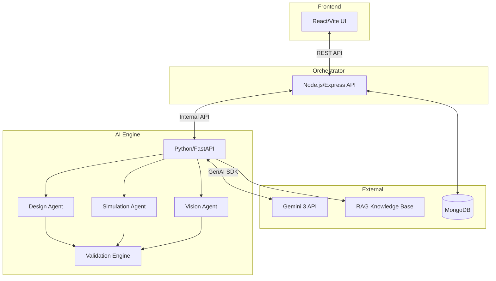

<![CDATA[<div align="center">
  <h1>⚡ NEXA</h1>
  <p><strong>AI-Powered Electronics Engineering Agent</strong></p>
  <p>
    <em>Built with </em>
  </p>
  <p>
    
    
    
    
  </p>
</div>

---

## 🎯 The Problem

Electronics engineering students and hobbyists face a steep learning curve. Debugging a faulty circuit often requires expensive equipment, expert knowledge, or hours of trial-and-error. Traditional LLMs can "help," but they often **hallucinate** incorrect component values or dangerous configurations.

## 💡 Our Solution

**Nexa** is not just another chatbot. It's an **agentic AI platform** that combines the reasoning power of **Google Gemini 3** with a deterministic **Physics Validation Engine**. It doesn't just generate text—it **designs, simulates, validates, and explains** complex electronic circuits.

---

## 🏆 Judging Criteria Alignment

| Criteria                    | Score | How We Excel                                                                                                   |
| :-------------------------- | :---: | :------------------------------------------------------------------------------------------------------------- |
| **Technical Execution**     |  40%  | Multi-agent architecture with Gemini 3 function calling. Physics-backed validation engine. Automated Test Lab. |
| **Innovation / Wow Factor** |  30%  | Vision Agent for schematic-to-code. AI-powered SPICE-level simulation. Self-correcting designs.                |
| **Potential Impact**        |  20%  | Democratizes hardware for students. Reduces prototyping time from hours to seconds.                            |
| **Presentation / Demo**     |  10%  | Interactive Test Lab UI. Clear documentation. Mermaid architecture diagrams.                                   |

---

## 🤖 The Agent Swarm

Nexa is powered by a **collaborative swarm of 7 specialized AI agents**, all coordinated by the Orchestrator.

|   #   | Agent                | Location               | Unique Capability                              |
| :---: | :------------------- | :--------------------- | :--------------------------------------------- |
|   1   | **Orchestrator**     | All Pages              | Intent routing & agent coordination            |
|   2   | **Design Agent**     | Chat, Schematic        | Generates schematics, BOM & firmware from text |
|   3   | **Diagnostic Agent** | Troubleshoot, Analyzer | Root-cause analysis using physics reasoning    |
|   4   | **Simulation Agent** | Analyzer, PCB          | SPICE-level Bode plots, transient analysis     |
|   5   | **Code Agent**       | Code Editor            | Firmware generation for ESP32/Arduino          |
|   6   | **Vision Agent**     | PCB, Schematic         | Schematic-to-Netlist from images               |
|   7   | **Component Agent**  | Components             | Smart component recommendations                |

---

## ✨ Core Capabilities

### 🔧 1. Agentic Circuit Design
Give Nexa a vague idea, and it generates a **complete engineering package**.

**Input:** `"Design an RGB LED circuit with ESP32 for color mixing"`

**Output:**
-   ✅ ASCII Schematic Diagram
-   ✅ Simulation Results (DC Bias, Peak Current, PWM Frequency)
-   ✅ Bill of Materials (BOM)
-   ✅ Production-ready C++ Firmware

### 🧠 2. Physics-Validated Debugging
Nexa doesn't guess. It **calculates** using Ohm's Law, Kirchhoff's Laws, and component datasheets.

**Example:** User connects `10kΩ` resistor to LED.
-   **Nexa Analysis:** `I = V/R = 3.3V / 10kΩ = 0.33mA` → **Dim!**
-   **Nexa Fix:** Recommends `220Ω` for `15mA` optimal brightness.

### 👁️ 3. Vision-Powered Analysis
Upload a photo of your breadboard or a schematic image, and the **Vision Agent** extracts components and connections.

### 📈 4. AI-Powered Circuit Simulation
No SPICE installation required. The **Simulation Agent** generates:
-   Bode plots (frequency response)
-   Transient analysis waveforms
-   DC operating points
-   Power dissipation calculations

### 🎓 5. Adaptive Learning System
Nexa adjusts its explanations based on your skill level.
-   **Beginner:** "A resistor limits current like a narrow pipe limits water..."
-   **Advanced:** "Apply Thevenin's theorem to simplify the network..."
-   **Viva Mode:** Generates interview-style Q&A to test your knowledge.

---

## 🧩 10+ Gemini Function Declarations

Nexa uses Gemini's **Function Calling** to decide which tool to invoke. These are the core functions available:

| Function                    | Description                                     |
| :-------------------------- | :---------------------------------------------- |
| `analyze_circuit`           | Deep-dive analysis with fault detection         |
| `calculate_component_value` | Verified physics calculations (Ohm's Law, etc.) |
| `fetch_datasheet`           | RAG-powered component specs lookup              |
| `fetch_lab_rule`            | Lab safety rules & best practices               |
| `validate_solution`         | Cross-check calculations before presenting      |
| `generate_project_plan`     | Structured project plan with components         |
| `generate_learning_summary` | Viva questions & concept explanations           |
| `fetch_common_mistake`      | Proactive warnings for known pitfalls           |
| `get_user_profile`          | Retrieve skill level & learning history         |

---

## 🏗️ Technical Architecture



### Tech Stack

| Layer              | Technologies                             |
| :----------------- | :--------------------------------------- |
| **Frontend**       | React 18, TypeScript, Tailwind CSS, Vite |
| **Orchestrator**   | Node.js, Express, JWT Auth               |
| **AI Engine**      | Python 3.12, FastAPI, Google GenAI SDK   |
| **Database**       | MongoDB                                  |
| **Knowledge Base** | YAML-based RAG (Datasheets, Lab Rules)   |

---

## 🚀 Quick Start

### Prerequisites
-   Python 3.9+
-   Node.js 18+
-   MongoDB (running at `localhost:27017`)

### Installation

```bash
# 1. Clone the repository
git clone https://github.com/your-repo/nexa.git
cd nexa

# 2. Configure Environment
# Add your GEMINI_API_KEY to backend/.env

# 3. Run the platform
chmod +x run.sh
./run.sh
```

### Access Points

| Service        | URL                                                              |
| :------------- | :--------------------------------------------------------------- |
| 📱 **App**      | [http://localhost:5173](http://localhost:5173)                   |
| 🧪 **Test Lab** | [http://localhost:5173/test-lab](http://localhost:5173/test-lab) |
| 📡 **API**      | [http://localhost:5000](http://localhost:5000)                   |

---

## 📂 Project Structure

```text
nexa/
├── backend/
│   ├── api/              # FastAPI Endpoints
│   ├── services/         # AI Agents (Design, Vision, Simulation)
│   ├── functions/        # Gemini Function Declarations
│   ├── knowledge_base/   # RAG Data (Datasheets, Lab Rules)
│   └── validators/       # Physics Validation Engine
├── frontend/
│   ├── src/pages/        # React Pages (Chat, PCB Viewer, Test Lab)
│   └── src/components/   # UI Components
├── docs/                 # Architecture & Planning Docs
├── run.sh                # One-click startup script
└── README.md             # You are here!
```

---

## 📚 Documentation

| Document                                               | Description                     |
| :----------------------------------------------------- | :------------------------------ |
| [User Manual](./USER_MANUAL.md)                        | End-user guide for all features |
| [Testing Guide](./TESTING_GUIDE.md)                    | How to use the Test Lab         |
| [Architecture Roadmap](./docs/architecture_roadmap.md) | System design & future plans    |

---

## ⚖️ License

This project is licensed under the **MIT License**.

---

<div align="center">
  <p><em>Engineering Intelligence for Everyone</em></p>
  <p>© 2026 Nexa Platform</p>
</div>
]]>
