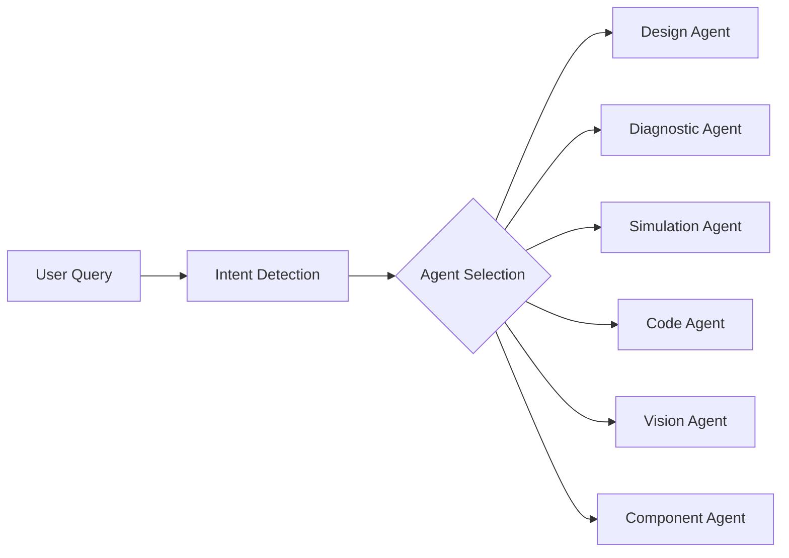
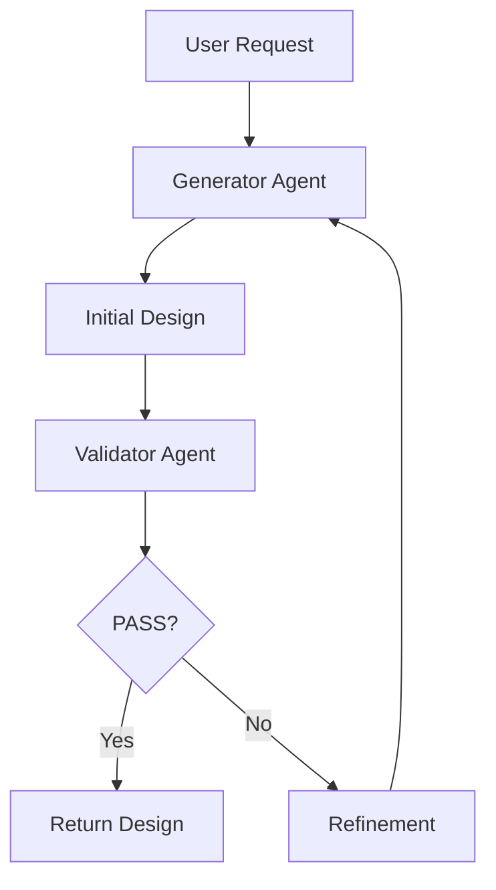

# Nexa AI Agent System Documentation

> Complete guide for all 7 AI agents with Input/Output/Process details.

---

## Agent Overview

| #   | Agent            | Frontend Location      | Capability                                    | Status   |
| --- | ---------------- | ---------------------- | --------------------------------------------- | -------- |
| 1   | **Orchestrator** | All pages              | Intent routing + agent coordination           | ✅ Active |
| 2   | **Design**       | Chat, Schematic        | Dual-agent circuit generation with validation | ✅ Active |
| 3   | **Diagnostic**   | Troubleshoot, Analyzer | Root-cause analysis with physics reasoning    | ✅ Active |
| 4   | **Simulation**   | Analyzer, PCB          | SPICE-level circuit simulation                | ✅ Active |
| 5   | **Code**         | Code Editor            | Firmware generation from circuit specs        | ✅ Active |
| 6   | **Vision**       | PCB, Schematic         | Image-to-circuit extraction                   | ✅ Active |
| 7   | **Component**    | Components             | Smart component recommendations               | ✅ Active |

---

## 1. Orchestrator Agent

**File**: `services/orchestrator_agent.py`  
**API**: `POST /api/orchestrator/route`

### Purpose
Central intelligence that routes user requests to appropriate specialized agents using intent detection.

### Input
```json
{
  "query": "Design an LED circuit with ESP32",
  "context": {"session_id": "abc123"},
  "force_agent": null
}
```

### Process


1. **Intent Detection**: Gemini analyzes query to determine intent
2. **Agent Selection**: Routes to best agent (Design/Diagnostic/Simulation/Code/Vision/Component)
3. **Execution**: Calls selected agent with extracted parameters
4. **Aggregation**: Combines results into unified response

### Output
```json
{
  "content": "Agent response text",
  "agent_used": "design",
  "reasoning_chain": ["Detected intent: design", "Executed design agent"],
  "confidence": 0.92,
  "agent_results": {...}
}
```

### API Endpoints
| Method | Endpoint                          | Description           |
| ------ | --------------------------------- | --------------------- |
| POST   | `/api/orchestrator/route`         | Main routing endpoint |
| POST   | `/api/orchestrator/detect-intent` | Intent detection only |
| GET    | `/api/orchestrator/agents`        | List available agents |

---

## 2. Design Agent

**File**: `services/design_agent.py`  
**API**: `POST /api/design/generate`

### Purpose
Creates circuit designs using dual-agent architecture (Generator + Validator).

### Input
```json
{
  "project_description": "Smart temperature monitor with ESP32 and OLED display",
  "components": ["ESP32", "DHT22", "OLED 128x64"],
  "constraints": "Battery powered, low power"
}
```

### Process


1. **Generator**: Creates initial circuit design with schematic
2. **Validator**: Physics-based verification of design
3. **Refinement**: If validation fails, generator fixes issues
4. **PCB Generation**: Optional PCB layout generation

### Output
```json
{
  "content": "Circuit design with schematic description",
  "validation_status": "PASS",
  "pcb_data": {...},
  "pcb_svg": "<svg>...</svg>",
  "bom": [{"name": "ESP32", "quantity": 1, "price": 8.99}]
}
```

---

## 3. Diagnostic Agent

**File**: `ai-engine/main.py` → `/analyze-text`  
**API**: `POST /api/diagnostics/analyze`

### Purpose
Troubleshoots circuit problems with physics-based root-cause analysis.

### Input
```json
{
  "text": "My LED is not turning on. Connected to ESP32 GPIO2 with 220 ohm resistor.",
  "components": ["ESP32", "LED", "Resistor 220R"],
  "supply_voltage": 3.3
}
```

### Process
1. **Parse Description**: Extract components and connections
2. **Physics Analysis**: Apply Ohm's Law, KVL, KCL
3. **Fault Detection**: Identify potential issues
4. **Root Cause**: Determine most likely cause
5. **Solution**: Provide step-by-step fix

### Output
```json
{
  "structured_analysis": {
    "potential_faults": [{"type": "wrong_polarity", "severity": "critical"}],
    "physics_checks": [{"law": "Ohm's Law", "result": "Current = 5.9mA"}],
    "root_cause": "LED connected in reverse"
  },
  "solution_steps": ["Check LED polarity", "Long leg to positive"],
  "verified_by": ["Ohm's Law", "LED Characteristics"]
}
```

---

## 4. Simulation Agent

**File**: `services/simulation_agent.py`  
**API**: `POST /api/simulation/run`

### Purpose
AI-powered SPICE-level circuit simulation without requiring SPICE installation.

### Input
```json
{
  "circuit_description": "RC low-pass filter with R=10K and C=100nF",
  "simulation_type": "analog"
}
```

### Process
1. **Detect Circuit Type**: Analog/Digital/Power
2. **Generate Simulation**: Based on circuit type:
   - **Analog**: Bode plots, frequency response
   - **Digital**: Truth tables, timing
   - **Power**: Efficiency, thermal analysis
3. **Return Results**: With graph data

### Output
```json
{
  "simulation_type": "analog",
  "bode_plot": {
    "frequencies": [1, 10, 100, 1000],
    "magnitude_db": [0, -3, -20, -40],
    "phase_deg": [0, -45, -84, -89]
  },
  "cutoff_frequency": 159.15,
  "analysis_notes": "Low-pass filter with fc = 159Hz"
}
```

---

## 5. Code Agent

**File**: `services/code_generator.py`  
**API**: `POST /api/code/generate`

### Purpose
Generates firmware code for microcontrollers (Arduino, ESP32, Raspberry Pi Pico).

### Input
```json
{
  "project_description": "Read DHT22 sensor and display on OLED",
  "board": "esp32",
  "components": ["DHT22", "OLED SSD1306"]
}
```

### Process
1. **Parse Requirements**: Extract sensors, displays, communication
2. **Select Template**: Based on board type
3. **Generate Code**: With proper pin assignments
4. **Add Libraries**: Required library list

### Output
```json
{
  "files": [
    {"filename": "main.ino", "language": "arduino", "content": "..."}
  ],
  "libraries": [
    {"name": "DHT sensor library", "version": "1.4.4"}
  ],
  "wiring": [
    {"component": "DHT22", "pin": "DATA", "board_pin": "GPIO4"}
  ],
  "notes": "Install libraries via Arduino Library Manager"
}
```

---

## 6. Vision Agent

**File**: `services/vision_agent.py`  
**API**: `POST /api/vision/analyze`

### Purpose
Analyzes PCB and schematic images using Gemini Vision API.

### Input
```bash
# File upload
curl -X POST /api/vision/analyze \
  -F "file=@pcb_photo.jpg" \
  -F "analysis_type=component_extraction"
```

### Process
1. **Image Upload**: Accept file or base64
2. **Analysis Type Selection**:
   - `component_extraction`: Extract components from PCB
   - `schematic_to_netlist`: Convert schematic to connections
   - `pcb_defect_detection`: Find manufacturing defects
   - `circuit_recognition`: Identify circuit function
3. **Gemini Vision**: Process with multimodal AI
4. **Structured Output**: Return parsed results

### Output
```json
{
  "analysis_type": "component_extraction",
  "components": [
    {"name": "U1", "type": "IC", "value": "ESP32", "location": "center"}
  ],
  "confidence": 0.85,
  "metadata": {"board_info": {"size": "50x30mm", "layers": 2}}
}
```

### API Endpoints
| Method | Endpoint                           | Description                |
| ------ | ---------------------------------- | -------------------------- |
| POST   | `/api/vision/analyze`              | Analyze uploaded image     |
| POST   | `/api/vision/analyze-base64`       | Analyze base64 image       |
| POST   | `/api/vision/extract-components`   | Quick component extraction |
| POST   | `/api/vision/detect-issues`        | PCB defect detection       |
| POST   | `/api/vision/schematic-to-netlist` | Convert schematic          |

---

## 7. Component Agent

**File**: `services/component_service.py`  
**API**: `POST /api/components/search`

### Purpose
Searches and recommends electronic components with datasheet information.

### Input
```json
{
  "query": "temperature sensor i2c",
  "category": "sensor"
}
```

### Process
1. **Search**: Query component database
2. **Match**: Find relevant components
3. **Enrich**: Add specs, pinouts, footprints
4. **Recommend**: Suggest alternatives

### Output
```json
{
  "components": [
    {
      "name": "DHT22",
      "category": "sensor",
      "description": "Temperature and humidity sensor",
      "specs": {"operating_voltage": "3.3V-6V"},
      "pinout": {"VCC": "Power", "DATA": "Digital output", "GND": "Ground"},
      "footprint": "DHT11",
      "tags": ["temperature", "humidity", "digital"]
    }
  ]
}
```

---

## Frontend Integration

### Using Orchestrator (Recommended)

```javascript
// Automatic agent routing
const response = await fetch('/api/orchestrator/route', {
  method: 'POST',
  headers: {'Content-Type': 'application/json'},
  body: JSON.stringify({
    query: userMessage,
    context: {session_id: sessionId}
  })
});

const {content, agent_used, reasoning_chain} = await response.json();
// agent_used tells you which agent handled it
```

### Direct Agent Calls

```javascript
// Design Agent
await fetch('/api/design/generate', {...});

// Vision Agent (file upload)
const formData = new FormData();
formData.append('file', imageFile);
formData.append('analysis_type', 'component_extraction');
await fetch('/api/vision/analyze', {method: 'POST', body: formData});

// Simulation Agent
await fetch('/api/simulation/run', {...});
```

---

## Environment Variables

```env
GEMINI_API_KEY=your_api_key
GOOGLE_API_KEY=your_api_key  # fallback

# Optional per-agent keys
ORCHESTRATOR_API_KEY=...
DESIGN_AGENT_API_KEY=...
VISION_AGENT_API_KEY=...
```
